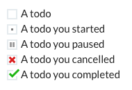

# "To do" Emojis

## Abstract

This repo contains a set of "to do" emojis:

You can use them in applications to create simple text-based to-do lists, **without plugins**:

They were created by [Dave Stewart](https://twitter.com/dave_stewart) for use in the [Weekend Club](https://twitter.com/weekendclubldn) [Slack](https://slack.com) channel; an [Indie Hackers](https://indiehackers.com) in-person and virtual network based in London.

## Usage in Slack

### Installation

To get the emojis into Slack:

- download the [zip](https://github.com/davestewart/todo-emojis/releases/tag/v1.0.0) with the [png](./emojis) files
- follow the instructions to add emojis [here](https://slack.com/intl/en-gb/help/articles/206870177-Add-custom-emoji-to-your-workspace-Add-custom-emoji-to-your-workspace)

When you add the emojis, be sure to name them the same as the filenames, i.e.:

- `todo`
- `todo_doing`
- `todo_done`
- `todo_cancel`

### Creating a to do list

Once added, just type `:todo` then choose the emoji from the list:

You can then label the todo with some text, and later, update your progress just by changing the emoji.

## Artwork

If you want to modify the emojis, the original [Sketch](https://www.sketch.com/) file is in the [artwork](./artwork) folder.

## License

This work is licensed as [CC0 1.0 Universal (CC0 1.0)](https://creativecommons.org/publicdomain/zero/1.0/deed.en).

