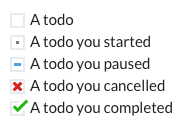

# "To do" Emojis

## Abstract

This repo contains a set of "to do" emojis:



You can use them in applications to create simple text-based to-do lists, **without plugins**:


They were created by [Dave Stewart](https://twitter.com/dave_stewart) for use in the [Weekend Club](https://twitter.com/weekendclubldn) [Slack](https://slack.com) channel; an [Indie Hackers](https://indiehackers.com) in-person and virtual network based in London.

## Usage in Slack

### Installation

To get the emojis into Slack:

- download the [zip](https://github.com/davestewart/todo-emojis/archive/v1.0.0.zip) with the [png](./emojis/@4x) files
- follow the instructions to add emojis [here](https://slack.com/intl/en-gb/help/articles/206870177-Add-custom-emoji-to-your-workspace-Add-custom-emoji-to-your-workspace)

Use the high-res `@4x` versions to support high-DPI displays.

When you add the emojis, be sure to name them the same as the filenames, i.e.:

- `todo`
- `todo_doing`
- `todo_done`
- `todo_cancel`

### Create a to do list

Once added, just type `:todo` then choose the emoji from the list:


Then, add the text of the todo (and any other todo's, of course):


### Share progress

You can use the `todo_doing` emoji to indicate you've started a task:


When you've completed your task, edit the message and change the emoji to `todo_done`:


If you want to let folks know you can't complete a task, use the `todo_cancel` emoji:


It's the simplest way to share updates in Slack! 

## Tips

### Shortcuts

You can create checkboxes even quicker using Slack's auto-complete:

```
:do   ->  :todo
:don  ->  :todo_done
:doi  ->  :todo_doing
:ca   ->  :todo_cancel
```

Copy and paste is also an option!

### Make a channel


Because you and your team will only be creating and updating a single message per day (or week) you may find it useful to create a dedicated channel, such as `#todos`, `#tasks`, `#today` or maybe `#shipped`.

Having a dedicated area for todo's means tasks won't get lost in a sea of other messages, and also provides a nice log of what got done and when.

## Are you using Todo Emojis?

Let me know!

- [Tweet me](https://twitter.com/dave_stewart)
- [Comment here](https://github.com/davestewart/todo-emojis/issues/1)
- [Comment on Product Hunt](https://www.producthunt.com/posts/todo-emojis)

## Share this!

It would be great if you would upvote this on Product Hunt:

<a href="https://www.producthunt.com/posts/todo-emojis?utm_source=badge-featured&utm_medium=badge&utm_souce=badge-todo-emojis" target="_blank"></a>

Twitter is also another great place to share:

- https://twitter.com/dave_stewart/status/1309861492007862277

Thanks :)

## Artwork

If you want to modify the emojis, the original [Sketch](https://www.sketch.com/) file is in the [artwork](./artwork) folder.

This work is licensed as [CC0 1.0 Universal (CC0 1.0)](https://creativecommons.org/publicdomain/zero/1.0/deed.en).

